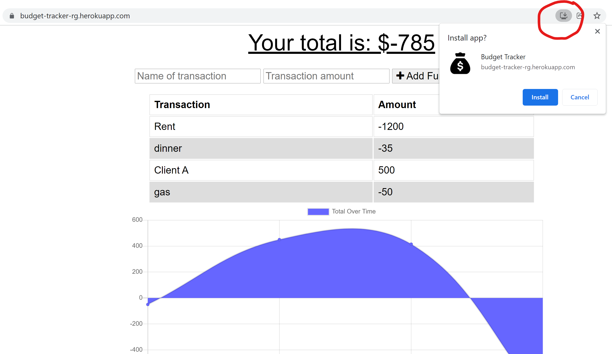

# Budget Tracker 

## About
This is a budget tracker that you can use offline. If your internet goes down or you are on airplane mode you can still add expenses and income to your budget tracker. When you come back online your entries will be saved.

Since this is also a Progressive Web App, you can download it and store it as an app on your phone or desktop. It is a shortcut to open as an application instead of going to the URL address in your browser.

Deployed at: https://budget-tracker-rg.herokuapp.com/ 

Git Repo: https://github.com/robyng/desert-log-budget-tracker 

## Technologies
* MongoDB
* Mongoose library
* IndexedDB
* Node.js
* PWA - manifest.json and service-worker.js
* Express library
* Morgan
* Compression

## How to Download PWA

Look for the icon on the right-hand side of your URL bar in your browser. The icon looks like a computer with a down arrow on it. Click it and select Install to download the PWA. It will be added to your desktop as a shortcut or added to your apps list in your phone.

