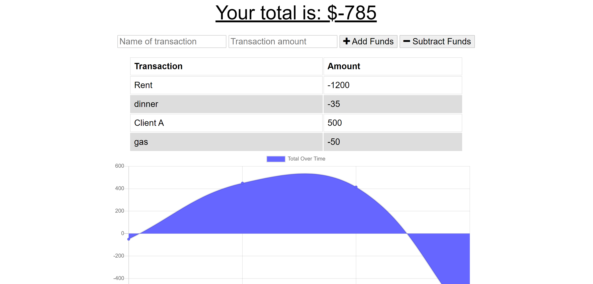

# Budget Tracker 

## About
This is a budget tracker that you can use offline. If your internet goes down or you are on airplane mode you can still add expenses and income to your budget tracker. When you come back online your entries will be saved.

Since this is also a Progressive Web App, you can download it and store it as an app on your phone or desktop. It is a shortcut to open as an application instead of going to the URL address in your browser.

Deployed at: https://budget-tracker-rg.herokuapp.com/ 

Git Repo: https://github.com/robyng/desert-log-budget-tracker 

